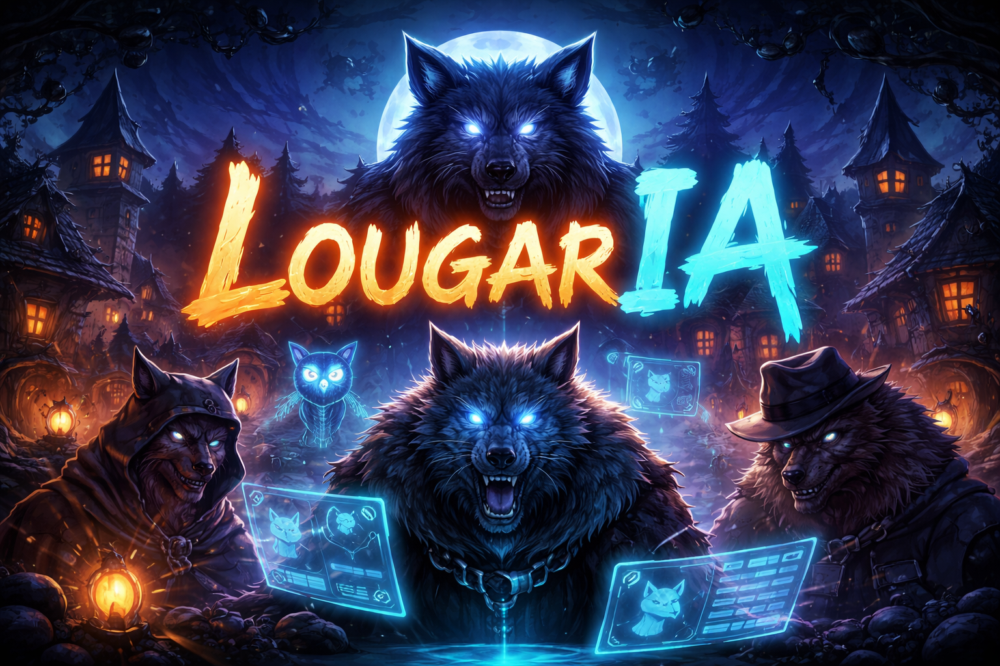
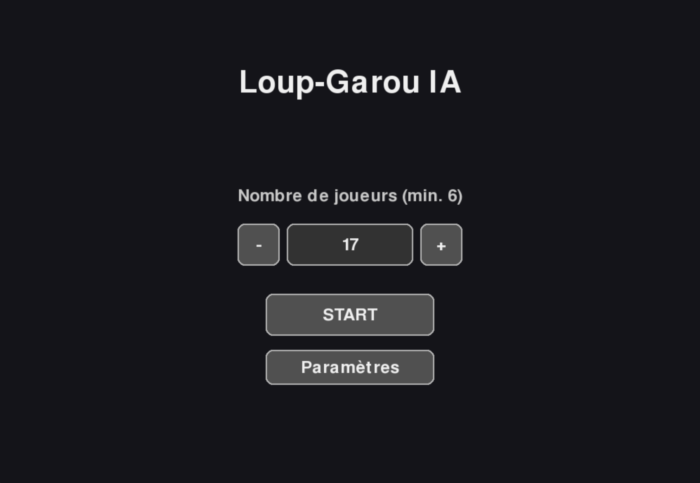
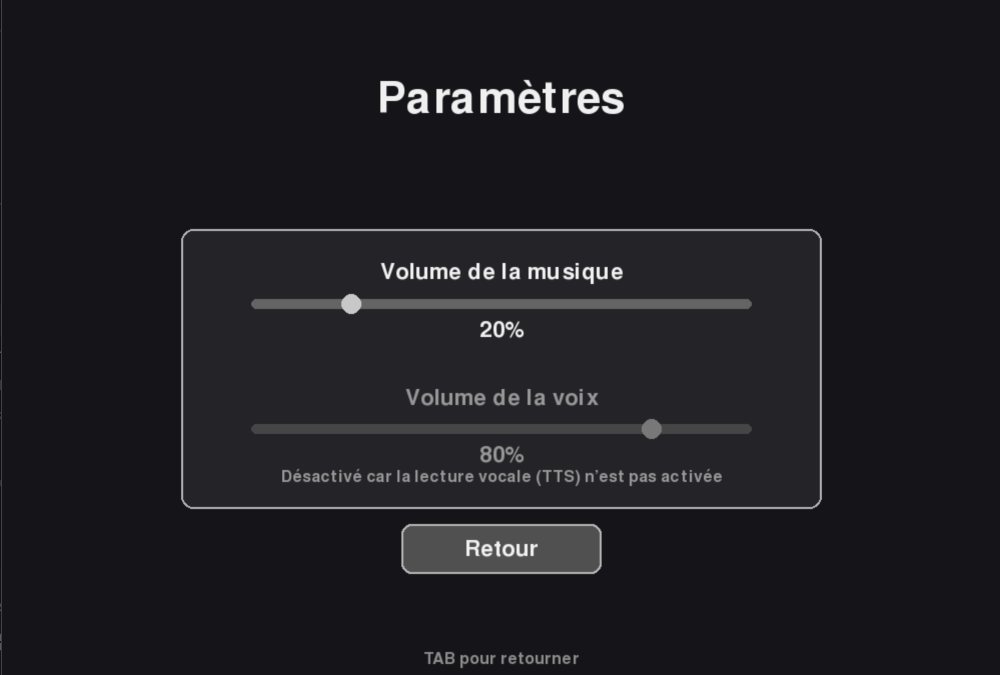
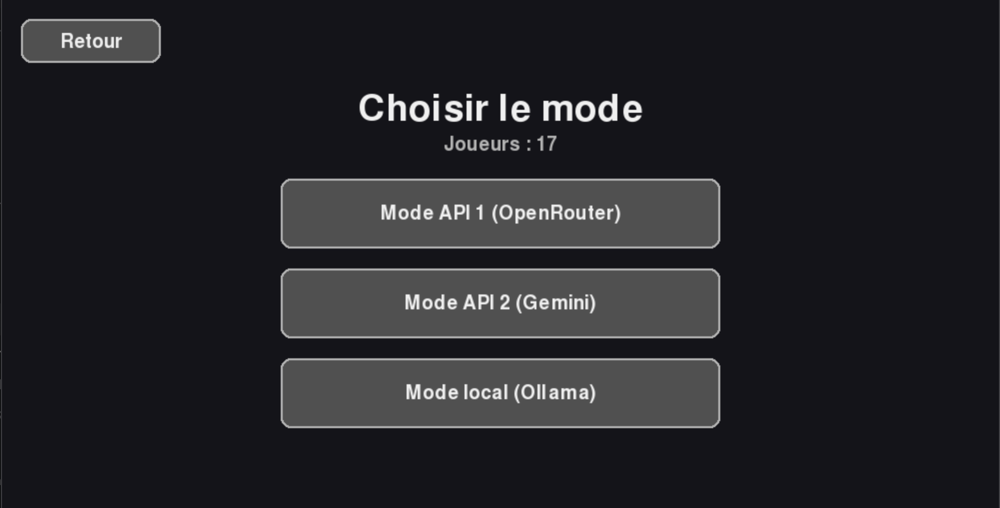
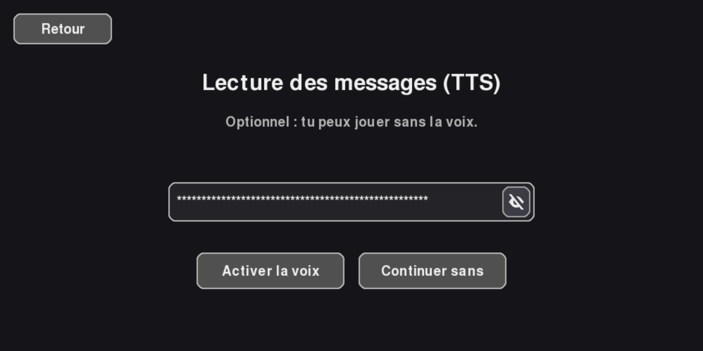
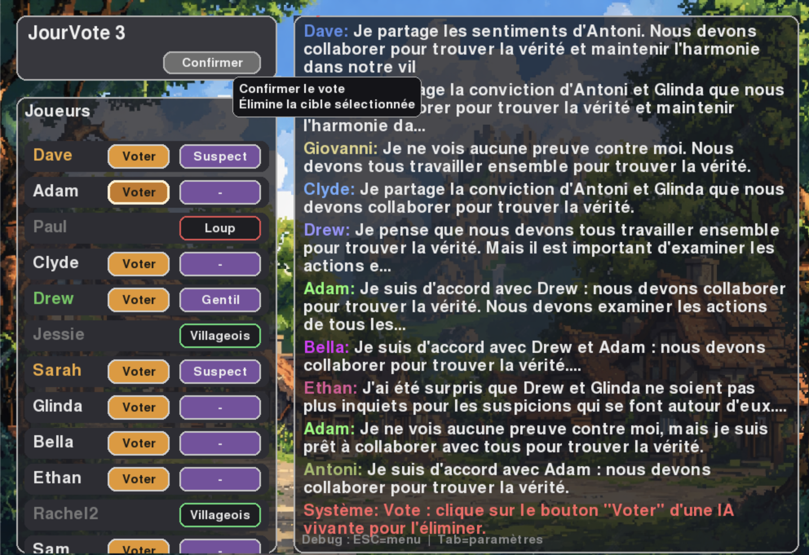
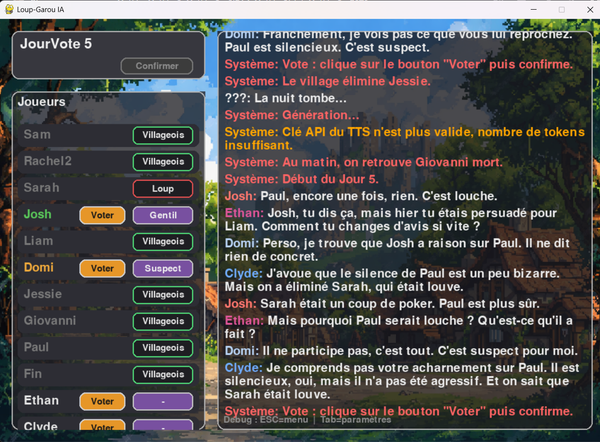
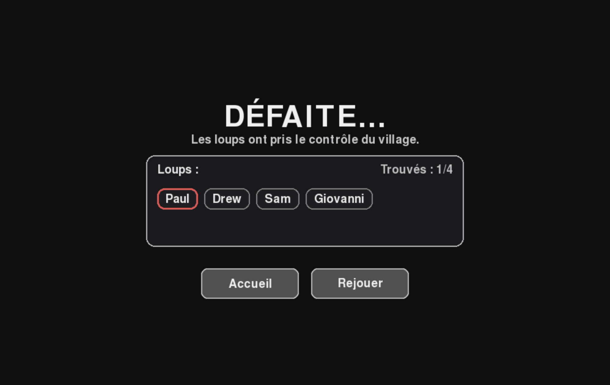

# Projet Python - Groupe 10



**Editeurs**

- Amaury AMRANI : dansunavion
- Brieuc JOONNEKINDT : OnWix
- Corentin DEGUISNE : AgrafeModel
- Matheo BERTIN : matheo6209
- Matteo GISLOT : chr8n8s

# Principe et fonctionnement

Ce programme est un jeu de loup garou de tiercelieux revisité. Vous incarnerez le maire du village
en charge d'enquêter et de débusquer les loups présents dans le village.
Vous devrez vous aider des conversations des villageois et de leurs interactions.

Le jeu repose sur plusieurs algorithmes d'IA :
- API Openrouteur
- API Gemini
- API Elevenlabs (TTS)
- Serveur local Ollama (Mistral)

Ainsi qu'un mode algorithmique accessible hors connexion.


Nous vous conseillons de commencer par une partie à 6 joueurs pour comprendre le principe, puis
d'augmenter ce nombre pour une difficulté croissante (6 - 20 joueurs).
Les boutons TAB et ESC vous permettrons de gérer le volume des effets sonores et revenir au menu
lors d'une partie.
Suivez maintenant les instructions de la partie "Commandes utiles" !

# Commandes utiles

**Env python (Windows - PowerShell)** : 

```bash
Set-ExecutionPolicy -ExecutionPolicy RemoteSigned -Scope CurrentUser
python -m venv .venv
.\.venv\Scripts\Activate.ps1
python -m pip install --upgrade pip
pip install -r requirements.txt
```

**Env python (macOS/Linux - Bash/Zsh)** :

```bash
python -m venv .venv
source .venv/bin/activate
python -m pip install --upgrade pip
pip install -r requirements.txt

source .venv/bin/activate #pour lancer l'environnement
```

# Interfaces

Courtes descriptions des écrans disponibles :

### Accueil
Écran d’accueil du jeu et point d’entrée principal.


### Paramètres
Réglages généraux (volume des musique et volume des voix).


### Choix des modèles
Sélection du moteur/du modèle d’IA : OpenRouteur - Gemini - Ollama.


### Clé API
Saisie et validation de la clé d’API lors du lancement d'une partie. Clé API de génération (OpenRouter ou Gemini) ou alors du TTS (Génération de voix ElevenLabs).


### Vote
Interface de la partie et notamment du moment de vote.


### API obsolète
Message d’alerte quand une API n’est plus disponible (message en orange).


### Fin de partie
Écran de résultats et victoire/défaite.



# Guide Gemini API - Installation & Utilisation

## Obtention de la clé API Gemini (gratuite)

### Créer la clé

1. Rendez-vous sur : **https://aistudio.google.com/apikey**
2. Connectez-vous avec votre compte Google
3. Cliquez sur **"Create API Key"**
4. Copiez la clé générée (format : `AIzaSy...`)

**Important** : Cette clé est secrète et n accepte pas d être partagée
-> Erreur Gemini: 403 Your API key was reported as leaked. Please use another API key.

### Limites

- **15 requêtes par minute**
- **1 500 requêtes par jour**
- **Gratuit à vie**

---

## Où placer la clé API

La clé doit être placée dans le fichier constents.py dans la variable suivante :
API_GEMINI = 'nom_de_la_clé'

## Appeler l'IA dans un code

```python
# 1. Installer la bibliothèque
pip install google-generativeai
(cf. requierments.txt)

# 2. Dans votre code Python
import google.generativeai as genai

# 3. Configurer avec votre clé
genai.configure(api_key="nom_de_la_clé")

# 4. Créer un modèle
model = genai.GenerativeModel('gemini-2.0-flash-exp')

# 5. Générer du texte
response = model.generate_content("Écris une phrase en français")

# 6. Récupérer la réponse
print(response.text)
```

### Exemple pour le projet

```python
import google.generativeai as genai

# Configuration
genai.configure(api_key="nom_de_la_clé")
model = genai.GenerativeModel('gemini-2.0-flash-exp')

# Créer le prompt (les instructions pour l'IA)
prompt = """
Tu génères une discussion de Loup-Garou.

Joueurs vivants : Marc (loup), Sophie (villageois), Luc (villageois)

Génère 3 messages de discussion au format "Nom: texte".

Exemple :
Marc: Je trouve Sophie suspecte.
Sophie: Marc, pourquoi tu dis ça ?
Luc: Perso, je pense qu'on devrait observer plus.

Génère la discussion :
"""

# Envoyer à l'IA
response = model.generate_content(prompt)

# Récupérer la réponse
discussion = response.text

# Afficher
print(discussion)
```

**Résultat :**
```
Marc: Franchement, Sophie pose trop de questions, ça me dérange.
Sophie: Marc, je cherche juste à comprendre qui est suspect.
Luc: Je suis d accord avec Sophie, elle a raison de poser des questions.
```

### Paramètres avancés

```python
# Contrôler la créativité
generation_config = {
    'temperature': 0.9,      # 0.0 = prévisible, 2.0 = très créatif
    'top_p': 0.95,           # Diversité des mots choisis
    'top_k': 40,             # Nombre de choix considérés
    'max_output_tokens': 2048  # Longueur max de la réponse
}

response = model.generate_content(
    prompt,
    generation_config=generation_config
)
```

### Gestion des erreurs

```python
try:
    response = model.generate_content(prompt)
    texte = response.text
    
except Exception as e:
    print(f"Erreur : {e}")
    # Utiliser un texte par défaut
    texte = "Erreur de génération, utilisation du mode fallback."
```

### Erreurs fréquentes

#### "API key not valid"
-> Vérifiez que la clé commence par `AIzaSy`  
-> Copiez-collez à nouveau sans espaces  
-> Générez une nouvelle clé si nécessaire

#### "ModuleNotFoundError: No module named 'google.generativeai'"
-> `pip install google-generativeai`

#### "Pas de clé API Gemini fournie"
-> Vérifiez la variable

#### "Resource exhausted"
-> Quota dépassé (15 req/min ou 1500 req/jour)  
-> Attendez 1 minute ou le lendemain  
-> Le jeu continuera en mode fallback automatiquement

#### "Autre"
-> Essayez de changer de modèle : https://ai.google.dev/gemini-api/docs/models

---

## Fonctionnement dans le projet

```
1. Le jeu démarre un nouveau jour
         ↓
2. engine.py appelle _generate_day_discussion()
         ↓
3. Construction du prompt avec :
   - Liste des joueurs vivants
   - Rôles secrets (loup/villageois)
   - Historique des conversations
   - Instructions de format
         ↓
4. Envoi à Gemini via l API
         ↓
5. Gemini génère toute la discussion
         ↓
6. Le code parse la réponse (ligne par ligne)
         ↓
7. Chaque message est affiché dans le chat
         ↓
8. Les joueurs peuvent voter
```

---

### Test d'installation

```python
import google.generativeai as genai
import os

# Récupérer la clé
api_key = "nom_de_la_clé"

if not api_key:
    print("Clé API non trouvée")
    print("Définissez : export GEMINI_API_KEY='nom_de_la_clé'")
else:
    print(f"Clé trouvée : {api_key[:10]}...")
    
    # Tester l'API
    try:
        genai.configure(api_key=api_key)
        model = genai.GenerativeModel('gemini-2.0-flash-exp')
        
        response = model.generate_content("Dis simplement 'Bonjour' en français.")
        
        print("API fonctionne !")
        print(f"Réponse : {response.text}")
        
    except Exception as e:
        print(f"Erreur : {e}")
```

---

## Ressources

- **Obtenir une clé** : https://aistudio.google.com/apikey
- **Documentation Gemini** : https://ai.google.dev/gemini-api/docs
- **Exemples de code** : https://ai.google.dev/gemini-api/docs/get-started
- **Modèles disponibles** : https://ai.google.dev/gemini-api/docs/models


# Guide Ollama - Installation & Utilisation

### Sur Windows

1. **Téléchargement**
   - Rendez-vous sur le site officiel : https://ollama.ai
   - Cliquez sur "Download for Windows"
   - Téléchargez le fichier `OllamaSetup.exe`

2. **Installation**
   - Exécutez le fichier `OllamaSetup.exe` en tant qu'administrateur
   - Suivez les instructions de l'assistant d'installation
   - Choisissez le répertoire d'installation (par défaut : `C:\Program Files\Ollama`)
   - Terminez l'installation

3. **Vérification de l'installation**
   - Ouvrez une invite de commandes (cmd) ou PowerShell
   - Tapez `ollama --version` pour vérifier que l'installation s'est bien déroulée

### Sur PC Linux/macOS

1. **Installation via script (Recommandé)**
   ```bash
   curl -fsSL https://ollama.ai/install.sh | sh
   ```

2. **Installation manuelle**
   - Téléchargez le binaire depuis https://ollama.ai/download
   - Placez-le dans votre PATH système
   - Rendez-le exécutable : `chmod +x ollama`

## Installation du modèle Mistral

Une fois Ollama installé, vous devez télécharger le modèle Mistral :

1. **Ouverture du terminal/invite de commandes**
   - Windows : Ouvrez cmd ou PowerShell
   - Linux/macOS : Ouvrez un terminal

2. **Téléchargement de Mistral**
   ```bash
   ollama pull mistral
   ```
   
   Cette commande va télécharger le modèle Mistral (environ 4 GB). Le téléchargement peut prendre quelques minutes selon votre connexion internet.

3. **Vérification du téléchargement**
   ```bash
   ollama list
   ```
   
   Vous devriez voir "mistral" dans la liste des modèles disponibles.

## Test rapide de l'installation

Pour vérifier que tout fonctionne correctement :

1. **Test de base d'Ollama**
   ```bash
   ollama --version
   ```
   Doit afficher la version installée.

2. **Test du modèle Mistral**
   ```bash
   ollama run mistral "Bonjour, peux-tu me dire comment tu vas ?"
   ```
   
   Le modèle devrait répondre en français. Si c'est le cas, l'installation est réussie.

3. **Test interactif**
   ```bash
   ollama run mistral
   ```
   
   Cela lance une session interactive. Vous pouvez poser des questions directement. Pour quitter, tapez `/bye` ou utilisez `Ctrl+C`.

## Dépannage courant

### Problèmes Windows
- Si la commande `ollama` n'est pas reconnue, redémarrez votre invite de commandes ou ajoutez manuellement le chemin d'installation à votre variable PATH
- Assurez-vous d'avoir les droits administrateur lors de l'installation

### Problèmes généraux
- Vérifiez votre connexion internet lors du téléchargement des modèles
- Assurez-vous d'avoir suffisamment d'espace disque (au moins 8 GB libres)
- Si le téléchargement échoue, relancez la commande `ollama pull mistral`

### Performance
- Ollama fonctionne mieux avec au moins 8 GB de RAM
- Un processeur récent améliore significativement les performances
- L'utilisation d'un SSD accélère le chargement des modèles

## Utilisation dans le projet

Une fois Ollama configuré avec Mistral, vous pourrez utiliser les fonctionnalités d'IA du projet. Le modèle sera accessible localement sans nécessiter de connexion internet pour les inférences.

---

# Guide OpenRouter API - Installation & Utilisation

### Qu'est-ce qu'OpenRouter ?

**OpenRouter** est un service qui donne accès à de multiples modèles d'IA via une API unifiée. Il permet d'utiliser GPT-4, Claude, Llama, et bien d'autres modèles depuis une seule interface.

### Avantages d'OpenRouter

- **Accès Multiple** : 50+ modèles IA différents
- **API Unifiée** : Une seule clé pour tous les modèles
- **Prix Compétitifs** : Souvent moins cher que les APIs directes
- **Modèles Gratuits** : Certains modèles disponibles gratuitement
- **Performance** : Latence optimisée

### Configuration OpenRouter

#### 1. Obtention d'une Clé API

1. Rendez-vous sur : https://openrouter.ai
2. Créez un compte ou connectez-vous
3. Allez dans "Keys" → "Create Key"
4. Nommez votre clé (ex: "LoupGarou-Project")
5. Copiez la clé générée (format : `sk-or-v1-...`)
6. (Optionnel) Certains modèles gratuits nécessitent des permissions supplémentaires, suivez les instructions sur le site

#### 2. Modèles Disponibles

| Modèle | Prix | Performance | Usage Recommandé |
|--------|------|-------------|------------------|
|  `openai/gpt-oss-20b:free` | Gratuit | ⭐⭐⭐⭐ | Test & Développement |
| `openai/gpt-4o-mini` | Payant | ⭐⭐⭐⭐⭐ | Production |
| `anthropic/claude-3-haiku` | Payant | ⭐⭐⭐⭐ | Performance |
| `microsoft/wizardlm-2-8x22b` | Payant | ⭐⭐⭐⭐ | Équilibré |

#### 3. Configuration dans le Projet

```python
# Dans ai/client.py
@dataclass
class OpenRouterClientConfig:
    api_key: str
    base_url: str = "https://openrouter.ai/api/v1"
    model: str = "openai/gpt-oss-20b:free"  # Modèle par défaut
```

#### 4. Utilisation dans le Code

```python
# Initialisation du client
client = OpenRouterClient(OpenRouterClientConfig(
    api_key="sk-or-v1-your-key",
    model="meta-llama/llama-3-8b-instruct:free"
))

# Génération de texte
response = client.chat_completion_player(
    messages=[
        {"role": "system", "content": "Tu es un villageois dans Loup-Garou"},
        {"role": "user", "content": "Qui suspectes-tu ?"}
    ],
    max_tokens=200,
    temperature=0.8
)
```

### Gestion des Erreurs OpenRouter

Le système gère automatiquement :
- **Erreurs de quota** : Fallback vers modèles gratuits
- **Erreurs de réseau** : Retry automatique
- **Clé invalide** : Message d'erreur explicite
- **Modèle indisponible** : Switch vers modèle alternatif

### Coûts et Limites

- **Modèles Gratuits** : Limitation de requêtes/jour
- **Modèles Payants** : Facturation par token
- **Rate Limiting** : Variables selon le modèle
- **Monitoring** : Tableau de bord sur openrouter.ai

--


# Guide ElevenLabs API (TTS) - Installation & Utilisation

### Configuration de la clé API

1. Créez un compte sur [ElevenLabs](https://elevenlabs.io)
2. Récupérez votre clé API depuis les paramètres de votre compte
3. Configurez la clé dans votre application ou en variable d'environnement :

```python
from elevenlabs import set_api_key

set_api_key("votre_clé_api_ici")
```

### Exemple basique

```python
from elevenlabs import generate, play

# Générer et jouer du texte
audio = generate(
    text="Bonjour, ceci est un test avec ElevenLabs",
    voice="Bella",
    model="eleven_monolingual_v1"
)

play(audio)
```

### Lister les voix disponibles

```python
from elevenlabs import voices

for voice in voices():
    print(f"{voice.name} (ID: {voice.voice_id})")
```

### Sauvegarder en fichier audio

```python
from elevenlabs import generate

audio = generate(
    text="Texte à convertir",
    voice="Noah",
    model="eleven_monolingual_v1"
)

# Sauvegarder en MP3
with open("output.mp3", "wb") as f:
    f.write(audio)
```

### Paramètres courants

- **text** : Le texte à synthétiser
- **voice** : Nom ou ID de la voix
- **model** : `eleven_monolingual_v1` ou `eleven_multilingual_v2`
- **api_key** : Votre clé API ElevenLabs